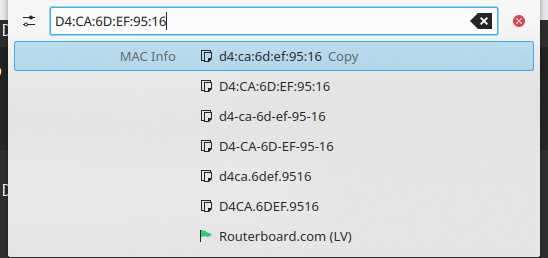

# KRunner MAC info plugin

This plugin will format entered MAC into all available formats and will try to detect the vendor.

MAC database based on http://standards-oui.ieee.org/oui.txt

Requires Python 3.8

For install run ./install.sh

